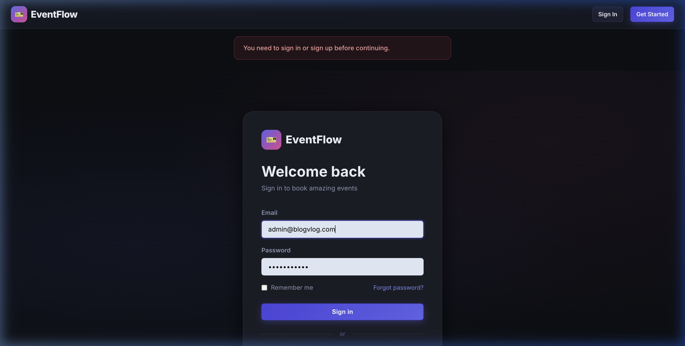
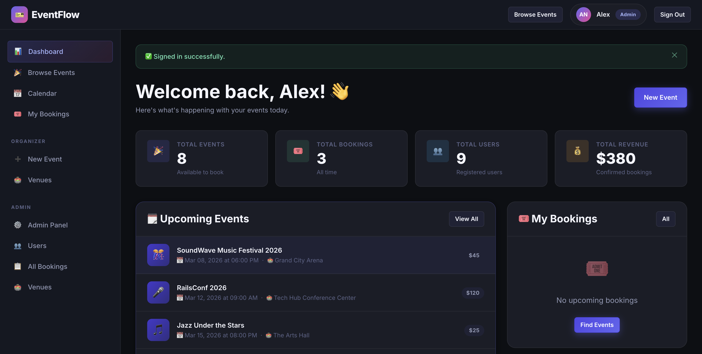
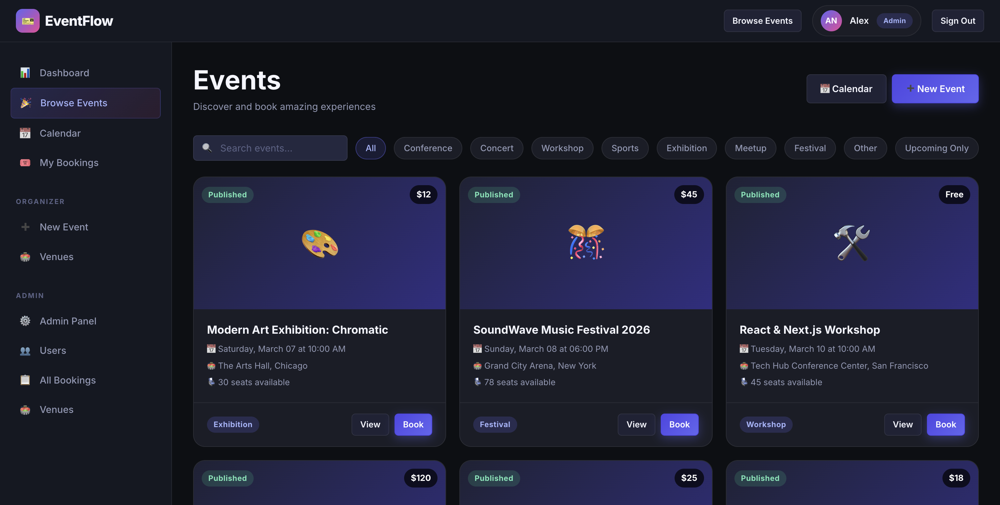
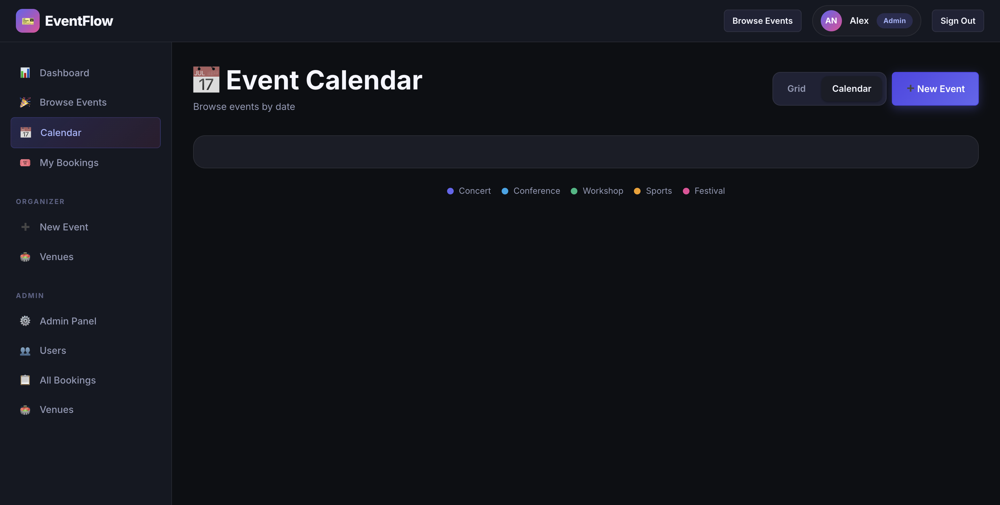
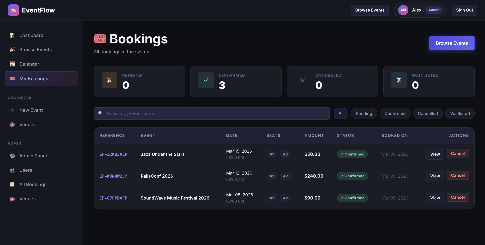
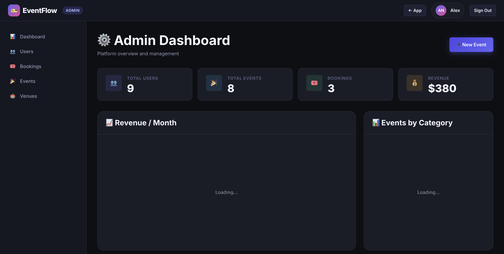

<div align="center">

# 🎫 EventFlow

**A premium Event Booking System built with Ruby on Rails 8**

[](https://www.ruby-lang.org)
[](https://rubyonrails.org)
[](https://postgresql.org)
[](https://rspec.info)
[](LICENSE)

*Discover, book, and manage events — with real-time seat selection, role-based access control, and automated email reminders.*

</div>

---

## 📸 Screenshots

### Sign In — Premium dark-mode auth


### Dashboard — Role-aware stats & upcoming events


### Events — Browseable grid with category filters


### Calendar — FullCalendar integration with colour-coded categories


### My Bookings — Status tracking & cancellation


### Admin Dashboard — Platform-wide analytics


---

## ✨ Features

### 🎟️ Event Management
- Create, edit, publish, and cancel events
- Category tagging (Conference, Concert, Workshop, Sports, Exhibition, Meetup, Festival)
- Start/end datetime with duration calculation
- Capacity management linked to real venue seat counts
- Draft → Published → Cancelled/Completed lifecycle
- FullCalendar interactive month/week/day calendar view
- Cover image upload via Active Storage

### 💺 Seat Selection & Booking
- Interactive seat map with live availability
- Row/column grid auto-generated per venue (up to 50×50)
- VIP, Standard, and Accessible seat types
- Atomic seat reservation with PostgreSQL row-level locking (prevents double-booking under concurrency)
- Booking reference codes (e.g. `EF-G7FPBAFP`)
- Free and paid events supported
- Booking cancellation with cascading reminder cleanup

### 📧 Email & Reminders
- HTML + plain-text booking confirmation emails via ActionMailer
- Automatic reminders scheduled **24 hours** and **1 hour** before each event
- Background job processing via SolidQueue (zero-dependency, DB-backed)
- Letter Opener for email preview in development

### 👥 Role-Based Access Control
| Role | Capabilities |
|------|-------------|
| **Attendee** | Browse events, book seats, manage own bookings |
| **Organizer** | + Create/edit/publish own events, view revenue |
| **Admin** | Full platform access — all events, bookings, users, venues |

- Powered by **Pundit** policies with a `Scope` resolver for every resource
- Organisers can only edit their own events; admins can edit any

### 📊 Admin Panel
- Platform statistics: users, events, bookings, revenue
- Revenue / Month and Events by Category charts (Chartkick + Groupdate)
- Full user management with role assignment
- Filterable bookings and events tables

### 🔐 Authentication
- Devise with email/password
- First name, last name, phone — extended registration form
- Remember me, forgot password
- Unauthenticated users can still browse published events

---

## 🏗️ Tech Stack

| Layer | Technology |
|-------|-----------|
| **Framework** | Ruby on Rails 8.1.2 |
| **Language** | Ruby 3.3.5 |
| **Database** | PostgreSQL 16 |
| **Asset Pipeline** | Propshaft + Import Maps |
| **Frontend** | Vanilla CSS (premium dark-mode design system), StimulusJS |
| **Calendar** | FullCalendar v6 (via CDN) |
| **Charts** | Chartkick + Groupdate |
| **Auth** | Devise 4.9 |
| **Authorisation** | Pundit 2.3 |
| **Pagination** | Pagy 8 |
| **Background Jobs** | SolidQueue |
| **File Uploads** | Active Storage + image_processing |
| **Email** | ActionMailer + Letter Opener (dev) |
| **Deployment** | Kamal 2 + Thruster (HTTP/2 proxy) |
| **Testing** | RSpec Rails, FactoryBot, Faker, Shoulda-Matchers, DatabaseCleaner, SimpleCov |

---

## 📁 Project Structure

```
eventflow/
├── app/
│   ├── controllers/
│   │   ├── application_controller.rb        # Pundit, Pagy, flash helpers
│   │   ├── dashboard_controller.rb
│   │   ├── events_controller.rb             # CRUD + publish/cancel
│   │   ├── bookings_controller.rb           # Seat reservation flow
│   │   ├── venues_controller.rb
│   │   ├── users/
│   │   │   ├── registrations_controller.rb  # Extended Devise registration
│   │   │   └── sessions_controller.rb
│   │   └── admin/
│   │       ├── base_controller.rb           # Admin guard
│   │       ├── dashboard_controller.rb
│   │       ├── users_controller.rb
│   │       ├── events_controller.rb
│   │       └── bookings_controller.rb
│   ├── models/
│   │   ├── user.rb          # Devise + role enum (attendee/organizer/admin)
│   │   ├── event.rb         # Status enum, validations, scopes, helpers
│   │   ├── venue.rb         # Auto-generates seat grid on create
│   │   ├── seat.rb          # seat_type enum, available scope
│   │   ├── booking.rb       # Reference code, schedule reminders, cancel!
│   │   ├── booking_seat.rb  # Join table
│   │   └── reminder.rb      # day_before / one_hour types, due scope
│   ├── policies/            # Pundit — EventPolicy, BookingPolicy, VenuePolicy
│   ├── services/
│   │   └── booking_service.rb   # Atomic seat lock + booking creation
│   ├── mailers/
│   │   ├── booking_confirmation_mailer.rb
│   │   └── booking_reminder_mailer.rb
│   ├── jobs/
│   │   └── send_reminder_job.rb
│   ├── helpers/
│   │   └── application_helper.rb  # event_emoji, status_badge, booking badges
│   └── views/
│       ├── layouts/
│       │   ├── application.html.erb   # Dark-mode layout, sidebar, navbar
│       │   └── admin.html.erb         # Admin-specific layout
│       ├── dashboard/
│       ├── events/                    # index, show, new, edit, calendar, _form
│       ├── bookings/                  # index, show, new (seat map)
│       ├── venues/                    # index, show, new, edit, _form
│       ├── admin/                     # dashboard, users, events, bookings
│       └── devise/                    # Custom sign-in, sign-up views
├── spec/
│   ├── models/             # User, Event, Venue, Seat, Booking, Reminder
│   ├── services/           # BookingService
│   ├── policies/           # EventPolicy, BookingPolicy
│   ├── requests/           # Events, Bookings (full HTTP integration tests)
│   └── factories/          # FactoryBot factories for all models
├── db/
│   ├── migrate/            # 12 migrations
│   └── seeds.rb            # 9 users, 3 venues, 8 events, 3 bookings
└── config/
    └── routes.rb           # Namespaced admin, nested bookings, custom actions
```

---

## 🚀 Getting Started

### Prerequisites

- Ruby 3.3.5
- PostgreSQL 16+
- Node.js (for asset compilation, optional with Import Maps)
- Bundler 2.5+

### 1. Clone the repository

```bash
git clone git@github.com:zumair12/eventflow.git
cd eventflow
```

### 2. Install dependencies

```bash
bundle install
```

### 3. Configure the database

Copy the example credentials and update with your PostgreSQL details:

```bash
cp config/database.yml.example config/database.yml
# Edit config/database.yml with your credentials
```

### 4. Set up the database

```bash
bin/rails db:create db:migrate db:seed
```

The seed task prints a credentials table:

```
  ┌─────────────────────────────────────────┬──────────────┬───────────┐
  │ Email                                   │ Password     │ Role      │
  ├─────────────────────────────────────────┼──────────────┼───────────┤
  │ admin@eventflow.app                     │ password123  │ Admin     │
  │ sam@eventflow.app                       │ password123  │ Organizer │
  │ jane@eventflow.app                      │ password123  │ Organizer │
  │ user1@example.com                       │ password123  │ Attendee  │
  └─────────────────────────────────────────┴──────────────┴───────────┘
```

### 5. Start the server

```bash
bin/rails server
# Visit http://localhost:3000
```

### 6. (Optional) Start background jobs

```bash
bin/jobs   # SolidQueue worker for reminders
```

---

## 🧪 Running Tests

```bash
# Full test suite
bundle exec rspec

# By type
bundle exec rspec spec/models/
bundle exec rspec spec/services/
bundle exec rspec spec/policies/
bundle exec rspec spec/requests/

# With documentation format
bundle exec rspec --format documentation

# Coverage report (opens in browser)
open coverage/index.html
```

**Current results: 154 examples, 0 failures, 1 pending**

### Test Coverage by Area

| Area | Examples | Description |
|------|---------|-------------|
| Models | 89 | Associations, validations, enums, scopes, instance methods |
| Services | 10 | BookingService — happy path, conflicts, free events |
| Policies | 24 | CRUD permissions + Scope for EventPolicy & BookingPolicy |
| Requests | 23 | Full HTTP integration via Devise test helpers |

---

## 🗺️ Routes Overview

```
GET    /                        → dashboard#index
GET    /events                  → events#index
GET    /events/calendar         → events#calendar
GET    /events/:id              → events#show
POST   /events                  → events#create
PATCH  /events/:id/publish      → events#publish
PATCH  /events/:id/cancel       → events#cancel

GET    /events/:event_id/bookings/new  → bookings#new  (seat map)
POST   /events/:event_id/bookings     → bookings#create
GET    /bookings                → bookings#index
GET    /bookings/:id            → bookings#show
PATCH  /bookings/:id/cancel     → bookings#cancel

GET    /venues                  → venues#index
GET    /venues/:id              → venues#show

# Admin namespace
GET    /admin                   → admin/dashboard#index
GET    /admin/users             → admin/users#index
PATCH  /admin/users/:id         → admin/users#update
DELETE /admin/users/:id         → admin/users#destroy
GET    /admin/events            → admin/events#index
GET    /admin/bookings          → admin/bookings#index
```

---

## 🎨 Design System

The app uses a hand-crafted CSS design system (`app/assets/stylesheets/application.css`) with:

- **Dark background palette**: `#0d0f14` → `#1a1d27` → `#222636`
- **Primary accent**: Indigo/Purple gradient (`#4f46e5` → `#6366f1`)
- **Secondary accent**: Pink/Rose (`#ec4899`)
- **Success**: Emerald (`#10b981`) · **Warning**: Amber (`#f59e0b`) · **Danger**: Rose
- **Typography**: Inter (via Google Fonts)
- **Components**: cards, badges, buttons (primary/secondary/danger), form controls, nav links, filter chips, seat map grid, flash messages
- **Animations**: `animate-fade-up`, `stagger-children`, hover transitions, shimmer loading

---

## 🔒 Security

- **Pundit** enforces authorisation on every controller action — a missing `authorize` call raises `Pundit::AuthorizationNotPerformedError`
- **CSRF protection** enabled application-wide (Rails default)
- **Strong parameters** on all controllers
- **Brakeman** static analysis in CI
- **Bundler Audit** checks for known gem vulnerabilities
- Passwords hashed with bcrypt via Devise

---

## 🚢 Deployment (Kamal)

```bash
# First-time setup
kamal setup

# Deploy
kamal deploy

# Rollback
kamal rollback
```

Configure `.kamal/secrets` and `config/deploy.yml` with your server details before deploying.

---

## 📄 License

This project is licensed under the **MIT License** — see the [LICENSE](LICENSE) file for details.

---

<div align="center">

Built with ❤️ using **Ruby on Rails 8** · **PostgreSQL** · **Pundit** · **RSpec**

</div>
